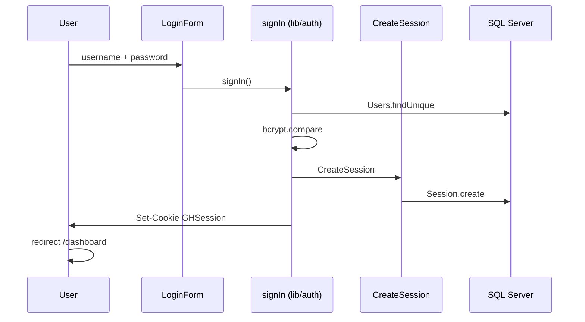
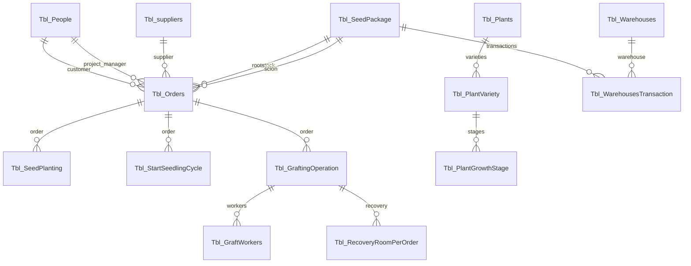

# Project Documentation — Fakoor Peyvand Aria (Green House Demo)

**Document version:** 1.0  
**Package name:** `green-house-demo`  
**UI language:** Persian (RTL)  
**System purpose:** Greenhouse operations management — master data, seed, orders, planting, seedling cycle, grafting, and recovery

---

## Table of Contents

1. [Introduction](#introduction)
2. [Technology Stack](#technology-stack)
3. [Prerequisites and Setup](#prerequisites-and-setup)
4. [Folder Structure](#folder-structure)
5. [Next.js Architecture in This Project](#nextjs-architecture-in-this-project)
6. [Authentication and Sessions](#authentication-and-sessions)
7. [Data Model and Database](#data-model-and-database)
8. [Business Workflow (End-to-End)](#business-workflow-end-to-end)
9. [Routes and Modules](#routes-and-modules)
10. [Feature Development Pattern](#feature-development-pattern)
11. [Shared Components](#shared-components)
12. [Public QR Pages](#public-qr-pages)
13. [UI, Theme, and Localization](#ui-theme-and-localization)
14. [Deployment (Docker)](#deployment-docker)
15. [npm Scripts](#npm-scripts)
16. [Known Limitations](#known-limitations)
17. [Troubleshooting](#troubleshooting)

---

## Introduction

This project is a **full-stack web application** built with **Next.js (App Router)**. Data is stored in **Microsoft SQL Server** via **Prisma ORM**. The UI uses **Ant Design** and **Tailwind CSS**, designed for Persian-speaking users (right-to-left).

Product branding in the UI: **Fakoor Peyvand Aria** — smart greenhouse management system.

The system is primarily an **operational CRUD and traceability** application, not a live IoT dashboard. The main dashboard route is a welcome/landing screen and does not show live KPIs from the database.

---

## Technology Stack

| Layer | Technology | Approx. version |
|-------|------------|-----------------|
| Framework | Next.js | 16.x |
| UI Library | React | 19.x |
| Component Library | Ant Design | 5.x |
| Styling | Tailwind CSS | 4.x |
| ORM | Prisma | 6.x |
| Database | SQL Server | — |
| Validation | Zod | 4.x |
| Forms | react-hook-form | 7.x |
| Auth | Custom (cookie + Session table) | — |
| QR | qrcode | 1.5.x |
| Print | react-to-print | 3.x |
| CSV Export | export-to-csv | 1.x |
| Theme | next-themes | 0.4.x |
| Dates | dayjs, jalaliday, react-multi-date-picker | — |
| Production runtime | Node.js standalone | 22 (Docker) |

**Note:** `@auth/prisma-adapter` is listed in `package.json` but is **not used** in the codebase. Authentication is fully custom.

**Prisma Client output:** `app/generated/prisma` (see `schema.prisma`)

---

## Prerequisites and Setup

### Requirements

- Node.js 20+ (22 recommended to match Dockerfile)
- Access to a SQL Server instance (local or remote)
- npm

### Environment Variables

Create `.env` at the project root from `.env.example` (`.env` is gitignored). **Never commit real credentials or paste them into documentation.**

```env
DATABASE_URL="sqlserver://HOST:1433;database=DB_NAME;user=USER;password=PASSWORD;encrypt=true;trustServerCertificate=true"
SHADOW_DATABASE_URL="sqlserver://HOST:1433;database=DB_NAME_shadow;user=USER;password=PASSWORD;trustServerCertificate=true"
```

### Install and Run

```bash
npm install
npx prisma generate
npm run dev
```

- Development: `http://localhost:3001` (port defined in `package.json`)
- Local production: `npm run build` then `npm start` (runs `server.js` from standalone output)

### Admin User Seed

```bash
npx prisma db seed
```

Configure the admin username and password **only in your local environment** via `prisma/seed.ts` (or environment variables). Do not commit credentials or document them in the repository.

---

## Folder Structure

```
green-house-demo/
├── app/                      # App Router — pages and layouts
│   ├── layout.tsx            # Root layout (fonts, Providers)
│   ├── page.tsx              # Login (/)
│   ├── providers.tsx         # Ant Design RTL + theme
│   ├── globals.css
│   ├── dashboard/            # Protected area
│   │   ├── layout.tsx        # requireAuth + Shell
│   │   ├── Shell.tsx         # Header + menu Drawer
│   │   ├── DashboardContent.tsx
│   │   └── */page.tsx        # One page per route
│   ├── public/scan/          # Public QR pages (no login)
│   └── api/auth/invalid/     # Clear invalid session cookie
├── features/                 # Domain modules
│   └── <name>/
│       ├── components/
│       ├── services/         # Server Actions
│       ├── schema/           # Zod (optional)
│       ├── types/
│       └── data/csvFileData.ts
├── shared/                   # Shared UI and utilities
│   ├── components/
│   └── utils/
├── lib/                      # auth, session, prisma singleton
├── prisma/
│   ├── schema.prisma
│   ├── seed.ts
│   └── migrations/
├── docs/                     # This documentation
├── public/                   # Fonts, logos, static assets
├── Dockerfile
├── next.config.ts
└── package.json
```

**Path alias:** `@/*` → project root (`tsconfig.json`)

---

## Next.js Architecture in This Project

### App Router

Each URL under `app/` maps to a `page.tsx` file. `layout.tsx` wraps child routes with shared chrome.

```
Request /dashboard/orders
    → app/dashboard/layout.tsx (auth + Shell)
        → app/dashboard/orders/page.tsx
            → features/orders/components/OrdersClientPage
```

### Server vs Client Components

| Type | Marker | Use in this project |
|------|--------|---------------------|
| Server Component | No `"use client"` | `page.tsx`, `layout.tsx`, some initial DB reads |
| Client Component | `"use client"` | Tables, modals, forms, QR, React state |
| Server Action | `"use server"` in `services/` | Prisma CRUD, `revalidatePath` |

### Server Actions and Prisma

- Singleton: `lib/singletone.ts`
- After mutations: `revalidatePath("/dashboard/...")`
- Prisma types (`Decimal`, `BigInt`, `Buffer`) must be serialized before sending to the client (e.g. `features/orders/services/read.ts`, `features/seedPlanting/services/read.ts`)

### Next Configuration

`next.config.ts`:

- `output: 'standalone'` — for Docker
- `experimental.serverActions.allowedOrigins`: `test.mygreenhouses.ir`, `localhost:3001`

---

## Authentication and Sessions

### Tables

- `Users`: `Username` (unique), `PasswordHash`, `RoleID`, `IsActive`
- `Session`: `PublicID`, `SecretHash`, `UserId`, `ExpiresAt`

### Sign-in Flow



### `GHSession` Cookie Format

```
csn_<publicId>.<secret>
```

- Random `publicId` and `secret`; only the secret hash is stored in the DB
- TTL: 1 day (default) or 30 days (remember me)
- `httpOnly`, `sameSite: lax`, `secure` in production

### Route Protection

- `app/dashboard/layout.tsx` → `requireAuth("/dashboard")`
- `app/page.tsx` → `requireAuth("/")` — redirects to `/dashboard` if already signed in
- Invalid/expired session → `/api/auth/invalid?next=/` (clears cookie)

### Sign-out

`removeAuth()` in `lib/auth.ts` — deletes DB session and clears the cookie

**Note:** `RoleID` exists in the schema; role-based access control is not enforced in the UI.

---

## Data Model and Database

Provider: **SQL Server**. Schema was introspected from an existing database; table names use the `Tbl_` prefix.

### Relationship Overview



### Tables and Roles

| Prisma Model | Role |
|--------------|------|
| `Tbl_People` | People (customer, project manager, technician, workers) |
| `Tbl_PeoplePosts` | Job posts / titles |
| `Tbl_suppliers` | Suppliers |
| `Tbl_Greenhouses` | Greenhouses (owner → People) |
| `Tbl_Plants` | Plant species |
| `Tbl_PlantVariety` | Varieties / cultivars |
| `Tbl_PlantGrowthStage` | Growth stages per variety |
| `Tbl_Warehouses` | Physical warehouses |
| `Tbl_SeedPackage` | Seed packages |
| `Tbl_WarehousesTransaction` | Seed warehouse in/out transactions |
| `Tbl_Orders` | Orders (rootstock + scion packages) |
| `Tbl_SeedPlanting` | Seed planting records |
| `Tbl_StartSeedlingCycle` | Seedling cycle tracking |
| `Tbl_GraftingOperation` | Grafting operations |
| `Tbl_GraftWorkers` | Grafting workers + per-worker loss |
| `Tbl_RecoveryRoomPerOrder` | Post-graft recovery per operation |
| `Tbl_NurseryRoom` | Master data for room/environment parameters |
| `Tbl_SeedlingPlanting` | **In schema only — no UI** |
| `Users` / `Session` | Application authentication |

### Important `Tbl_Orders` Fields

- `OrderCode`, `CustomerID`, `SupplierID`, `ProjectManager`
- `OrderDate`, `OrderCount`
- `RootstockID`, `ScionID` → `Tbl_SeedPackage`
- `QRCode` (Bytes) — UI mostly builds dynamic QR from URLs

---

## Business Workflow (End-to-End)

1. **Master data:** people, suppliers, greenhouses, plants, varieties, growth stages, warehouses, nursery room definitions
2. **Seed:** register packages → warehouse transactions
3. **Orders:** create order with rootstock and scion packages
4. **Planting:** seed planting linked to order and greenhouse
5. **Seedling cycle:** germination room exit, greenhouse entry/exit, losses
6. **Grafting:** operations + workers
7. **Operational recovery:** recovery room records per grafting operation
8. **Traceability:** print/scan order or seed package QR codes

---

## Routes and Modules

### Public Routes

| Route | File | Description |
|-------|------|-------------|
| `/` | `app/page.tsx` | Login |
| `/public/scan/orders/[id]` | `app/public/scan/orders/[id]/page.tsx` | Public order certificate |
| `/public/scan/seed-package/[id]` | `app/public/scan/seed-package/[id]/page.tsx` | Public seed package certificate |
| `/api/auth/invalid` | `app/api/auth/invalid/route.ts` | Clear session cookie |

**QR base URL in code:** `https://mygreenhouses.ir/public/scan/...`

### Dashboard — Route to Feature Mapping

| Route | Feature folder | Notes |
|-------|----------------|-------|
| `/dashboard` | — | `DashboardContent` welcome screen |
| `/dashboard/people` | `features/owners` | UI label: people; table `Tbl_People` |
| `/dashboard/suppliers` | `features/suppliers` | |
| `/dashboard/greenhouse` | `features/greenhouse` | |
| `/dashboard/plants` | `features/plants` | |
| `/dashboard/plantvarities` | `features/varities` | |
| `/dashboard/growthstages` | `features/growthstages` | |
| `/dashboard/warehouses` | `features/warehouses` | |
| `/dashboard/nursery-rooms` | `features/nurseryRooms` | Environment master data |
| `/dashboard/seed-package` | `features/seedPackage` | Includes print modal |
| `/dashboard/seed-warehousing` | `features/seedWarehousing` | |
| `/dashboard/orders` | `features/orders` | Includes `OrdersQRModal` |
| `/dashboard/seed-planting` | `features/seedPlanting` | |
| `/dashboard/start-seedling-cycle` | `features/startSeedlingCycle` | |
| `/dashboard/grafting` | `features/grafting` | Includes `WorkerQRModal` |
| `/dashboard/recoveryRoom` | `features/recoveryRoom` | Recovery per graft operation |

Side menu: `shared/components/Menu.tsx`

### Page Data Loading Patterns

| Pattern | Examples | Description |
|---------|----------|-------------|
| Server page + initialData | `people/page.tsx`, `grafting/page.tsx` | Fetch on server, pass props to client |
| Client page + useEffect | `orders`, `nursery-rooms` | Call `getAll*` on mount |

---

## Feature Development Pattern

### Standard Layout

```
features/<name>/
├── components/
│   ├── *Table.tsx
│   ├── *FormModal.tsx
│   ├── *DetailModal.tsx
│   └── *ClientPage.tsx (optional)
├── services/
│   ├── create.ts
│   ├── read.ts
│   ├── update.ts
│   ├── delete.ts
│   └── index.ts
├── schema/index.ts       # Zod (optional)
├── types/
└── data/csvFileData.ts   # CSV export (optional)
```

### Typical Service Response

```ts
{ status: "ok" | "error", message?: string, ... }
```

### Delete and Foreign Keys

`lib/helpers/prismaErrorHelper.ts` maps Prisma error `P2003` to a Persian user-facing message when records are referenced elsewhere.

### Validation

Zod schemas under `features/*/schema/`, used with react-hook-form in modals.

### Cache Invalidation

`revalidatePath` after create/update/delete on the matching dashboard route.

---

## Shared Components

| Component | Path | Purpose |
|-----------|------|---------|
| `Table` | `shared/components/Table.tsx` | Custom table (search, sort, pagination) |
| `PageHeader` | `shared/components/PageHeader.tsx` | Page title block |
| `GreenhouseButton` | `shared/components/GreenhouseButton.tsx` | Styled project button |
| `TableActions` | `shared/components/TableActions.tsx` | Edit/delete/detail actions |
| `InsertionRow` | `shared/components/InsertionRow.tsx` | Add row trigger |
| `DeleteModal` | `shared/components/DeleteModal.tsx` | Delete confirmation |
| `DetailModal` | `shared/components/DetailModal.tsx` | Read-only details |
| `QRCodeCanvas` | `shared/components/QRCodeCanvas.tsx` | Canvas QR rendering |
| `QRCodeModal` | `shared/components/QRCodeModal.tsx` | Generic QR modal |
| `Menu` | `shared/components/Menu.tsx` | Navigation drawer |
| `NavigationProgressBar` | — | NProgress on navigation |
| `ThemeToggle` | — | Light/dark mode |
| `LoginForm` | `shared/components/auth/LoginForm.tsx` | Sign-in form |

**Note:** `shared/utils/CastToPersian.tsx` (Latin → Persian digits) is not mounted in the root layout.

---

## Public QR Pages

### Orders

- Scan URL: `https://mygreenhouses.ir/public/scan/orders/{ID}`
- Data: `getOrderById` from `features/orders/services`
- Shows: customer, project manager, supplier, rootstock/scion details, QR code

### Seed Package

- URL: `https://mygreenhouses.ir/public/scan/seed-package/{ID}`
- Data: `getSeedPackageById`

### Dashboard QR Modals

- `OrdersQRModal`: label sizes (mm), plant type (rootstock/scion/grafted), certificate/label print via `react-to-print`
- `WorkerQRModal`: QR for grafting workers (name, person code, order)

---

## UI, Theme, and Localization

- **RTL:** `direction="rtl"` in Ant Design `ConfigProvider`
- **Locale:** `fa_IR` for Ant Design
- **Fonts:** IRANSansX (`public/fonts/`) — classes `font-IransansR`, `IransansB`
- **Theme:** `next-themes` (class `dark`) + Ant Design dark algorithm
- **Primary color:** Emerald (`#10b981`)
- **Jalali dates:** date pickers and `toLocaleDateString('fa-IR')`

---

## Deployment (Docker)

`Dockerfile` (multi-stage):

1. `npm install` + `npm run build`
2. Copy `standalone`, `.next/static`, `public`, `app/generated`, `prisma`
3. `CMD ["node", "server.js"]` — exposed port 3000

Root-level `*.tar` files (if present) are Docker image artifacts, not source code.

---

## npm Scripts

| Script | Command | Description |
|--------|---------|-------------|
| dev | `next dev -p 3001` | Development server |
| build | `next build` | Production build |
| start | `node server.js` | Run standalone server |
| lint | `eslint` | Lint |

Prisma seed: `npx prisma db seed` (configured as `tsx prisma/seed.ts` in `package.json`)

---

## Known Limitations

| Topic | Details |
|-------|---------|
| Root README | Still default create-next-app template |
| `PAGE_TITLES` in Shell | Incomplete for some newer routes |
| Dashboard | No live DB-driven statistics |
| `Tbl_SeedlingPlanting` | No UI module |
| RBAC | `RoleID` not enforced in UI |
| Naming | `owners` feature vs `people` route |
| Two “recovery” concepts | `nursery-rooms` = master data; `recoveryRoom` = operational logs |
| `@auth/prisma-adapter` | Installed but unused |

---

## Troubleshooting

| Issue | What to check |
|-------|----------------|
| Empty page / DB errors | `DATABASE_URL`, SQL Server firewall, `npx prisma generate` |
| Redirected to login always | `GHSession` cookie, session expiry, `/api/auth/invalid` |
| Prisma Client not found | Run `npx prisma generate` after clone |
| Server Action origin error | `allowedOrigins` in `next.config.ts` |
| Decimal/BigInt errors on client | Add serialization in `read.ts` services |
| Wrong port | Dev uses **3001**, not 3000 |

---

## Related Documentation

- [Persian documentation (فارسی)](./DOCUMENTATION.fa.md)
- [Next.js Documentation](https://nextjs.org/docs)
- [Prisma Documentation](https://www.prisma.io/docs)

---

*This document reflects the codebase at the time it was written.*
