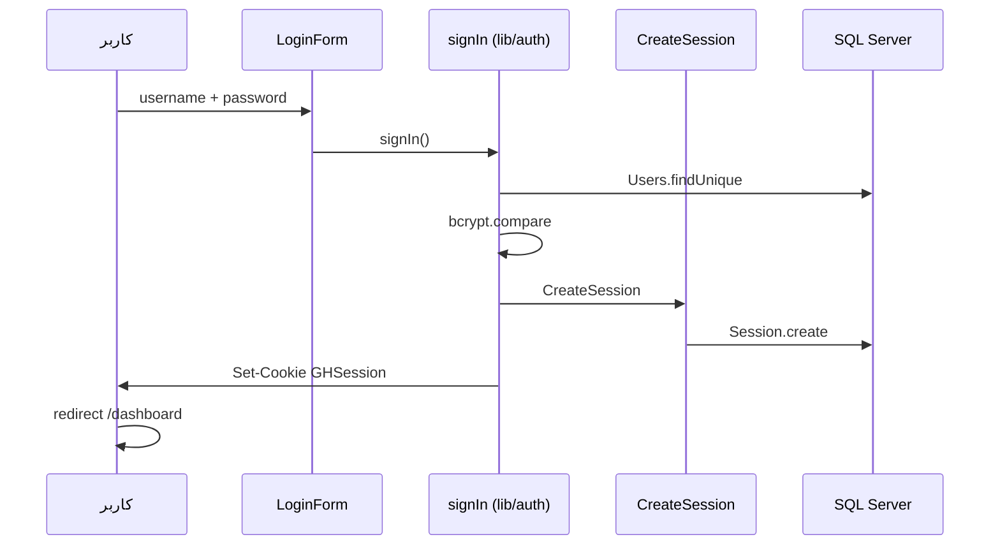
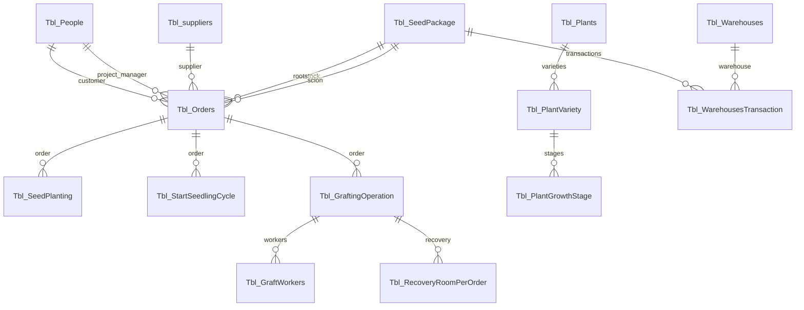

# مستندات پروژه — فکور پیوند آریا (Green House Demo)

**نسخه مستند:** 1.0  
**نام پکیج:** `green-house-demo`  
**زبان رابط:** فارسی (RTL)  
**هدف سیستم:** سامانه مدیریت عملیات گلخانه — از اطلاعات پایه و بذر تا سفارش، کاشت، سیکل نشاء، پیوند و ریکاوری

---

## فهرست مطالب

1. [معرفی](#معرفی)
2. [پشته فناوری](#پشته-فناوری)
3. [پیش‌نیازها و راه‌اندازی](#پیش‌نیازها-و-راه‌اندازی)
4. [ساختار پوشه‌ها](#ساختار-پوشه‌ها)
5. [معماری Next.js در این پروژه](#معماری-nextjs-در-این-پروژه)
6. [احراز هویت و نشست](#احراز-هویت-و-نشست)
7. [مدل داده و پایگاه داده](#مدل-داده-و-پایگاه-داده)
8. [جریان کسب‌وکار (End-to-End)](#جریان-کسب‌وکار-end-to-end)
9. [مسیرها و ماژول‌ها](#مسیرها-و-ماژول‌ها)
10. [الگوی توسعه Feature](#الگوی-توسعه-feature)
11. [کامپوننت‌های مشترک](#کامپوننت‌های-مشترک)
12. [صفحات عمومی QR](#صفحات-عمومی-qr)
13. [رابط کاربری، تم و بومی‌سازی](#رابط-کاربری-تم-و-بومی‌سازی)
14. [استقرار (Docker)](#استقرار-docker)
15. [اسکریپت‌های npm](#اسکریپت‌های-npm)
16. [محدودیت‌ها و نکات شناخته‌شده](#محدودیت‌ها-و-نکات-شناخته‌شده)
17. [عیب‌یابی](#عیب‌یابی)

---

## معرفی

این پروژه یک **اپلیکیشن وب full-stack** است که با **Next.js (App Router)** ساخته شده و داده‌ها را در **Microsoft SQL Server** از طریق **Prisma ORM** ذخیره می‌کند. رابط کاربری با **Ant Design** و **Tailwind CSS** پیاده‌سازی شده و برای کاربران فارسی‌زبان (راست‌به‌چپ) طراحی شده است.

برند محصول در UI: **فکور پیوند آریا** — سامانه مدیریت هوشمند گلخانه.

سیستم عمدتاً یک **سیستم ثبت و ردیابی عملیاتی (Operational CRUD)** است، نه پلتفرم IoT زنده؛ صفحه داشبورد اصلی بیشتر صفحه خوش‌آمدگویی است و KPI زنده از دیتابیس نمایش نمی‌دهد.

---

## پشته فناوری

| لایه | فناوری | نسخه (تقریبی) |
|------|--------|----------------|
| Framework | Next.js | 16.x |
| UI Library | React | 19.x |
| Component Library | Ant Design | 5.x |
| Styling | Tailwind CSS | 4.x |
| ORM | Prisma | 6.x |
| Database | SQL Server | — |
| Validation | Zod | 4.x |
| Forms | react-hook-form | 7.x |
| Auth | سفارشی (Cookie + Session table) | — |
| QR | qrcode | 1.5.x |
| Print | react-to-print | 3.x |
| CSV Export | export-to-csv | 1.x |
| Theme | next-themes | 0.4.x |
| Dates | dayjs, jalaliday, react-multi-date-picker | — |
| Runtime (prod) | Node.js standalone | 22 (Docker) |

**نکته:** پکیج `@auth/prisma-adapter` در `package.json` وجود دارد ولی در کد استفاده نشده؛ احراز هویت کاملاً دستی پیاده‌سازی شده است.

**خروجی Prisma Client:** `app/generated/prisma` (طبق `schema.prisma`)

---

## پیش‌نیازها و راه‌اندازی

### پیش‌نیازها

- Node.js 20+ (توصیه: 22 برای هم‌خوانی با Dockerfile)
- دسترسی به SQL Server (محلی یا راه‌دور)
- npm

### متغیرهای محیطی

فایل `.env` در ریشه پروژه (در `.gitignore`؛ از `.env.example` کپی بگیرید). **هرگز `.env` واقعی را commit نکنید.**

```env
DATABASE_URL="sqlserver://HOST:1433;database=DB_NAME;user=USER;password=PASSWORD;encrypt=true;trustServerCertificate=true"
SHADOW_DATABASE_URL="sqlserver://HOST:1433;database=DB_NAME_shadow;user=USER;password=PASSWORD;trustServerCertificate=true"
```

### نصب و اجرا

```bash
npm install
npx prisma generate
npm run dev
```

- توسعه: `http://localhost:3001` (پورت در `package.json` تعریف شده)
- Production local: `npm run build` سپس `npm start` (اجرای `server.js` از خروجی standalone)

### Seed کاربر مدیر

```bash
npx prisma db seed
```

نام کاربری و رمز مدیر را **فقط در محیط خودتان** در `prisma/seed.ts` (یا متغیرهای محیطی) تنظیم کنید. این مقادیر را در مستندات یا مخزن git قرار ندهید.

---

## ساختار پوشه‌ها

```
green-house-demo/
├── app/                      # App Router — صفحات و layout
│   ├── layout.tsx            # Root layout (فونت، Providers)
│   ├── page.tsx              # صفحه ورود (/)
│   ├── providers.tsx         # Ant Design RTL + تم
│   ├── globals.css
│   ├── dashboard/            # ناحیه محافظت‌شده
│   │   ├── layout.tsx        # requireAuth + Shell
│   │   ├── Shell.tsx         # هدر + Drawer منو
│   │   ├── DashboardContent.tsx
│   │   └── */page.tsx        # یک صفحه per مسیر
│   ├── public/scan/          # صفحات عمومی QR (بدون لاگین)
│   └── api/auth/invalid/     # پاک کردن کوکی نامعتبر
├── features/                 # ماژول‌های دامنه
│   └── <name>/
│       ├── components/
│       ├── services/         # Server Actions
│       ├── schema/           # Zod (اختیاری)
│       ├── types/
│       └── data/csvFileData.ts
├── shared/                   # UI و ابزار مشترک
│   ├── components/
│   └── utils/
├── lib/                      # auth, session, prisma singleton
├── prisma/
│   ├── schema.prisma
│   ├── seed.ts
│   └── migrations/
├── docs/                     # این مستندات
├── public/                   # فونت، لوگو، تصاویر استاتیک
├── Dockerfile
├── next.config.ts
└── package.json
```

**Alias مسیر:** `@/*` → ریشه پروژه (`tsconfig.json`)

---

## معماری Next.js در این پروژه

### App Router

هر URL زیر `app/` به فایل `page.tsx` متناظر است. `layout.tsx` قاب مشترک فرزندان را می‌پوشاند.

```
درخواست /dashboard/orders
    → app/dashboard/layout.tsx (auth + Shell)
        → app/dashboard/orders/page.tsx
            → features/orders/components/OrdersClientPage
```

### Server vs Client Components

| نوع | علامت | کاربرد در پروژه |
|-----|--------|------------------|
| Server Component | بدون `"use client"` | `page.tsx`، `layout.tsx`، خواندن اولیه DB در برخی صفحات |
| Client Component | `"use client"` | جداول تعاملی، مودال‌ها، فرم‌ها، QR، state |
| Server Action | `"use server"` در `services/` | CRUD Prisma، `revalidatePath` |

### Server Actions و Prisma

- Singleton: `lib/singletone.ts`
- پس از mutate: `revalidatePath("/dashboard/...")`
- انواع Prisma (`Decimal`, `BigInt`, `Buffer`) قبل از ارسال به Client باید serialize شوند (مثال: `features/orders/services/read.ts`, `features/seedPlanting/services/read.ts`)

### پیکربندی Next

`next.config.ts`:

- `output: 'standalone'` — برای Docker
- `experimental.serverActions.allowedOrigins`: `test.mygreenhouses.ir`, `localhost:3001`

---

## احراز هویت و نشست

### جداول

- `Users`: `Username` (unique), `PasswordHash`, `RoleID`, `IsActive`
- `Session`: `PublicID`, `SecretHash`, `UserId`, `ExpiresAt`

### جریان ورود



### فرمت کوکی `GHSession`

```
csn_<publicId>.<secret>
```

- `publicId` و `secret` تصادفی؛ فقط hash secret در DB
- TTL: ۱ روز (بدون «مرا به خاطر بسپار») یا ۳۰ روز (با remember)
- `httpOnly`, `sameSite: lax`, `secure` در production

### محافظت مسیرها

- `app/dashboard/layout.tsx` → `requireAuth("/dashboard")`
- `app/page.tsx` → `requireAuth("/")` — اگر لاگین باشد به `/dashboard` هدایت می‌شود
- نشست نامعتبر → `/api/auth/invalid?next=/` (پاک کردن کوکی)

### خروج

`removeAuth()` در `lib/auth.ts` — حذف Session از DB و پاک کردن کوکی

**نکته:** `RoleID` در schema وجود دارد؛ کنترل دسترسی نقش‌محور در UI پیاده نشده است.

---

## مدل داده و پایگاه داده

Provider: **SQL Server**. Schema از دیتابیس موجود introspect شده؛ نام جداول با پیشوند `Tbl_`.

### نمودار روابط (خلاصه)



### جداول و نقش

| جدول Prisma | نقش |
|-------------|------|
| `Tbl_People` | اشخاص (مشتری، مدیر پروژه، تکنسین، کارگر) |
| `Tbl_PeoplePosts` | سمت/پست شغلی |
| `Tbl_suppliers` | تامین‌کنندگان |
| `Tbl_Greenhouses` | گلخانه‌ها (مالک → People) |
| `Tbl_Plants` | انواع گیاه |
| `Tbl_PlantVariety` | ارقام/واریته |
| `Tbl_PlantGrowthStage` | مراحل رشد per variety |
| `Tbl_Warehouses` | انبار فیزیکی |
| `Tbl_SeedPackage` | بسته بذر |
| `Tbl_WarehousesTransaction` | تراکنش ورود/خروج بذر |
| `Tbl_Orders` | سفارش (پایه + پیوندک) |
| `Tbl_SeedPlanting` | کاشت بذر |
| `Tbl_StartSeedlingCycle` | سیکل نشاء |
| `Tbl_GraftingOperation` | عملیات پیوند |
| `Tbl_GraftWorkers` | کارگران پیوند + تلفات |
| `Tbl_RecoveryRoomPerOrder` | ریکاوری بعد از پیوند |
| `Tbl_NurseryRoom` | تعریف پایه اتاق/محیط (دما، نور، …) |
| `Tbl_SeedlingPlanting` | **در schema هست؛ UI ندارد** |
| `Users` / `Session` | احراز هویت اپ |

### فیلدهای مهم `Tbl_Orders`

- `OrderCode`, `CustomerID`, `SupplierID`, `ProjectManager`
- `OrderDate`, `OrderCount`
- `RootstockID`, `ScionID` → `Tbl_SeedPackage`
- `QRCode` (Bytes) — در UI عمدتاً QR پویا از URL ساخته می‌شود

---

## جریان کسب‌وکار (End-to-End)

1. **اطلاعات پایه:** اشخاص، تامین‌کنندگان، گلخانه، گیاه، واریته، مراحل رشد، انبار، اتاق پایه (`nursery-rooms`)
2. **بذر:** ثبت بسته (`seed-package`) → تراکنش انبار (`seed-warehousing`)
3. **سفارش:** ثبت سفارش با انتخاب پایه و پیوندک (`orders`)
4. **کاشت:** `seed-planting` مرتبط با سفارش و گلخانه
5. **نشاء:** `start-seedling-cycle` — خروج اتاق جوانه، ورود/خروج گلخانه، تلفات
6. **پیوند:** `grafting` + کارگران (`Tbl_GraftWorkers`)
7. **ریکاوری عملیاتی:** `recoveryRoom` per عملیات پیوند
8. **ردیابی:** چاپ/اسکن QR سفارش یا بسته بذر

---

## مسیرها و ماژول‌ها

### مسیرهای عمومی

| مسیر | فایل | توضیح |
|------|------|--------|
| `/` | `app/page.tsx` | ورود |
| `/public/scan/orders/[id]` | `app/public/scan/orders/[id]/page.tsx` | شناسنامه عمومی سفارش |
| `/public/scan/seed-package/[id]` | `app/public/scan/seed-package/[id]/page.tsx` | شناسنامه بسته بذر |
| `/api/auth/invalid` | `app/api/auth/invalid/route.ts` | پاکسازی کوکی |

**دامنه QR در کد:** `https://mygreenhouses.ir/public/scan/...`

### داشبورد — نگاشت مسیر به Feature

| مسیر | Feature folder | یادداشت |
|------|----------------|---------|
| `/dashboard` | — | `DashboardContent` — خوش‌آمد |
| `/dashboard/people` | `features/owners` | UI: اشخاص؛ جدول `Tbl_People` |
| `/dashboard/suppliers` | `features/suppliers` | |
| `/dashboard/greenhouse` | `features/greenhouse` | |
| `/dashboard/plants` | `features/plants` | |
| `/dashboard/plantvarities` | `features/varities` | |
| `/dashboard/growthstages` | `features/growthstages` | |
| `/dashboard/warehouses` | `features/warehouses` | |
| `/dashboard/nursery-rooms` | `features/nurseryRooms` | تعریف اتاق پایه |
| `/dashboard/seed-package` | `features/seedPackage` | + چاپ |
| `/dashboard/seed-warehousing` | `features/seedWarehousing` | |
| `/dashboard/orders` | `features/orders` | + `OrdersQRModal` |
| `/dashboard/seed-planting` | `features/seedPlanting` | |
| `/dashboard/start-seedling-cycle` | `features/startSeedlingCycle` | |
| `/dashboard/grafting` | `features/grafting` | + `WorkerQRModal` |
| `/dashboard/recoveryRoom` | `features/recoveryRoom` | ریکاوری per graft |

منوی کناری: `shared/components/Menu.tsx`

### الگوی بارگذاری داده در صفحات

| الگو | مثال | توضیح |
|------|------|--------|
| Server page + initialData | `people/page.tsx`, `grafting/page.tsx` | fetch در server، props به client |
| Client page + useEffect | `orders`, `nursery-rooms` | `getAll*` در mount |

---

## الگوی توسعه Feature

### ساختار استاندارد

```
features/<name>/
├── components/
│   ├── *Table.tsx
│   ├── *FormModal.tsx
│   ├── *DetailModal.tsx
│   └── *ClientPage.tsx (اختیاری)
├── services/
│   ├── create.ts
│   ├── read.ts
│   ├── update.ts
│   ├── delete.ts
│   └── index.ts          # re-export
├── schema/index.ts       # Zod (اختیاری)
├── types/
└── data/csvFileData.ts   # export CSV (اختیاری)
```

### قرارداد پاسخ سرویس

اغلب:

```ts
{ status: "ok" | "error", message?: string, ... }
```

### حذف و FK

`lib/helpers/prismaErrorHelper.ts` — خطای Prisma `P2003` به پیام فارسی «در X استفاده شده» تبدیل می‌شود.

### اعتبارسنجی

Zod schema در `features/*/schema/` — با react-hook-form در مودال‌ها ترکیب می‌شود.

### Cache

`revalidatePath` پس از create/update/delete روی مسیر داشبورد همان ماژول.

---

## کامپوننت‌های مشترک

| کامپوننت | مسیر | کاربرد |
|----------|------|--------|
| `Table` | `shared/components/Table.tsx` | جدول سفارشی (جستجو، sort، pagination) |
| `PageHeader` | `shared/components/PageHeader.tsx` | عنوان صفحه |
| `GreenhouseButton` | `shared/components/GreenhouseButton.tsx` | دکمه استایل پروژه |
| `TableActions` | `shared/components/TableActions.tsx` | ویرایش/حذف/جزئیات |
| `InsertionRow` | `shared/components/InsertionRow.tsx` | ردیف افزودن |
| `DeleteModal` | `shared/components/DeleteModal.tsx` | تایید حذف |
| `DetailModal` | `shared/components/DetailModal.tsx` | نمایش جزئیات |
| `QRCodeCanvas` | `shared/components/QRCodeCanvas.tsx` | رندر QR روی canvas |
| `QRCodeModal` | `shared/components/QRCodeModal.tsx` | مودال QR عمومی |
| `Menu` | `shared/components/Menu.tsx` | Drawer منو |
| `NavigationProgressBar` | — | NProgress |
| `ThemeToggle` | — | روشن/تاریک |
| `LoginForm` | `shared/components/auth/LoginForm.tsx` | ورود |

**توجه:** `shared/utils/CastToPersian.tsx` (تبدیل ارقام به فارسی) در layout mount نشده است.

---

## صفحات عمومی QR

### سفارش

- URL اسکن: `https://mygreenhouses.ir/public/scan/orders/{ID}`
- داده: `getOrderById` از `features/orders/services`
- نمایش: مشتری، مدیر، تامین‌کننده، پایه/پیوندک، QR

### بسته بذر

- URL: `https://mygreenhouses.ir/public/scan/seed-package/{ID}`
- داده: `getSeedPackageById`

### مودال QR در داشبورد

- `OrdersQRModal`: اندازه لیبل (mm)، نوع گیاه (rootstock/scion/grafted)، چاپ گواهی/لیبل (`react-to-print`)
- `WorkerQRModal`: QR برای کارگر پیوند (نام، کد پرسنلی، سفارش)

---

## رابط کاربری، تم و بومی‌سازی

- **RTL:** `direction="rtl"` در Ant Design ConfigProvider
- **Locale:** `fa_IR` برای Ant Design
- **فونت:** IRANSansX (`public/fonts/`) — کلاس‌های `font-IransansR`, `IransansB`
- **تم:** `next-themes` (class `dark`) + الگوریتم تاریک Ant Design
- **رنگ اصلی:** Emerald (`#10b981`)
- **تاریخ شمسی:** date pickerها و `toLocaleDateString('fa-IR')`

---

## استقرار (Docker)

`Dockerfile` (multi-stage):

1. `npm install` + `npm run build`
2. کپی `standalone`, `.next/static`, `public`, `app/generated`, `prisma`
3. `CMD ["node", "server.js"]` — پورت expose: 3000

فایل‌های `*.tar` در ریشه repo (در صورت وجود) artifact ایمیج Docker هستند، نه سورس.

---

## اسکریپت‌های npm

| Script | دستور | توضیح |
|--------|--------|--------|
| dev | `next dev -p 3001` | توسعه |
| build | `next build` | build production |
| start | `node server.js` | اجرای standalone |
| lint | `eslint` | lint |

Prisma seed: `npx prisma db seed` (تعریف در `package.json` → `tsx prisma/seed.ts`)

---

## محدودیت‌ها و نکات شناخته‌شده

| موضوع | جزئیات |
|--------|--------|
| README ریشه | هنوز قالب پیش‌فرض create-next-app |
| `PAGE_TITLES` در Shell | ناقص برای برخی مسیرهای جدید |
| داشبورد | بدون آمار زنده از DB |
| `Tbl_SeedlingPlanting` | بدون UI |
| RBAC | `RoleID` بدون enforcement در UI |
| نام‌گذاری | `owners` feature = `people` route |
| دو مفهوم «ریکاوری» | `nursery-rooms` = تعریف محیط؛ `recoveryRoom` = لاگ عملیاتی |
| `@auth/prisma-adapter` | نصب شده، استفاده نشده |

---

## عیب‌یابی

| مشکل | بررسی |
|------|--------|
| صفحه خالی / خطای DB | `DATABASE_URL`، فایروال SQL Server، `npx prisma generate` |
| همیشه به لاگین برمی‌گردد | کوکی `GHSession`، انقضای Session، `/api/auth/invalid` |
| Prisma Client not found | `npx prisma generate` بعد از clone |
| خطای Server Action origin | `allowedOrigins` در `next.config.ts` |
| Decimal/BigInt در client | serialize در `read.ts` |
| پورت اشتباه | dev = **3001** نه 3000 |

---

## مستندات مرتبط

- [English documentation](./DOCUMENTATION.en.md)
- [Next.js Docs](https://nextjs.org/docs)
- [Prisma Docs](https://www.prisma.io/docs)

---

*آخرین به‌روزرسانی مستند بر اساس وضعیت codebase در زمان نگارش.*
